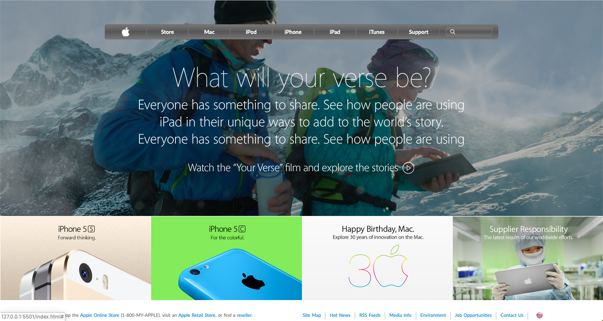

# [Apple clone](https://rawcdn.githack.com/KaushikShivam/apple_clone/047b9424ce1c25b873d342e675b0a6209dbe7f74/index.html) of [The old apple website](http://archive.fo/UW4oR)



## Table of content
- [Description](#description)
- [Installation](#installation)
- [Contact](#contact)

## Description
[The apple clone](https://rawcdn.githack.com/KaushikShivam/apple_clone/047b9424ce1c25b873d342e675b0a6209dbe7f74/index.html) project is the replica of an old apple landing page. It's built to learn gradients and positioning
[Reference link](http://archive.fo/UW4oR)


## Installation

1. Clone the project to your local directory
```
git clone https://github.com/KaushikShivam/apple_clone
```
2. Open the index.html file in your browser to view the website in all its glory (Live-server is recommended to view live changes automatically)

## Contact
You can contact me at:

- [Portfolio](https://www.shivamkaushik.com)
- [Email](mailto:shivamkaushikofficial@gmail.com)
- [Linkedin](https://www.linkedin.com/in/kshivamdev/)
- [Twitter](https://twitter.com/kShivamDev)
- [Medium](https://medium.com/@shivamkaushikofficial)
- [Angellist](https://angel.co/kshivamdev)


